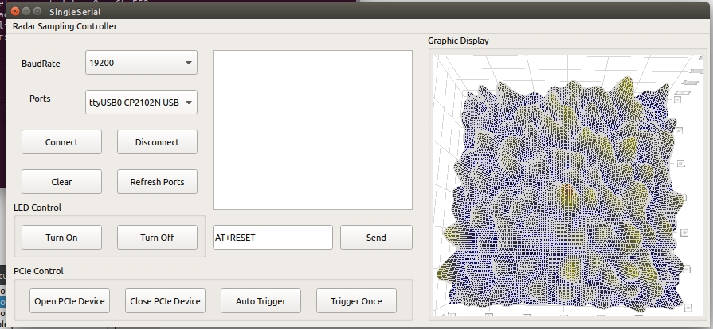

# Qt_3DDisplay
项目自用的通过Qt绘制三维坐标图像程序，用于嵌入上位机UI，实现对本地csv数据的读取和绘制三维坐标图，同时1s定时刷新1次。

# 开发环境
本项目是基于Nvidia-Jetson平台的，用于嵌入式GPU端的上位机。

Jetson Xavier NX + Ubuntu 18.04 + Qt 5.9.5

# 环境搭建
## 1.下载Qt5
sudo apt-get update

sudo apt-get install qt

## 2.安装datavisualization库
进行默认安装并未包含三维绘图所需的库（Windows版安装时可勾选），通过命令行进行安装。在Qt官网找到对应版本的qtdatavis3d的压缩包，下载本地。

qmake

make

make install

安装好之后就包含datavisualization库，检测方式是添加QT+=datavisualization看编译是否通过。

# 软件功能测试
该功能包含部分自用功能，主要测试三维绘图，读取本地的csv文件并完成图像绘制。上位机界面如下：

